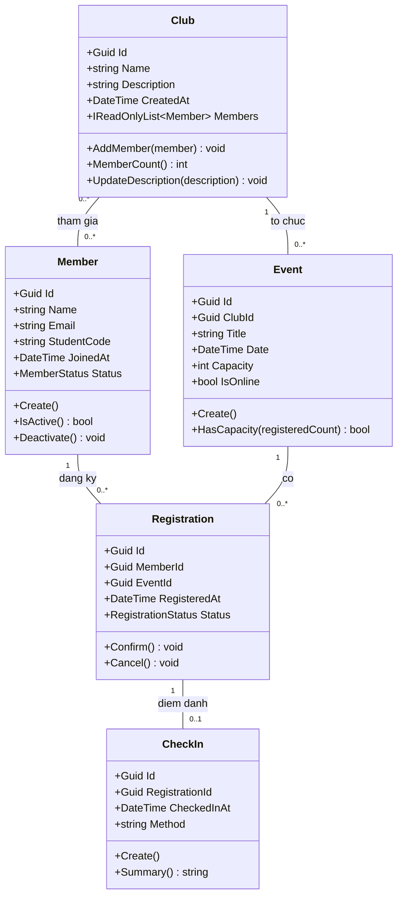

# Sơ đồ lớp EduHub

```mermaid
classDiagram
    direction TB

    class Member {
        +Guid Id
        +string Name
        +string Email
        +string StudentCode
        +DateTime JoinedAt
        +MemberStatus Status
        +Create()
        +IsActive() bool
        +Deactivate() void
    }

    class Club {
        +Guid Id
        +string Name
        +string Description
        +DateTime CreatedAt
        +IReadOnlyList~Member~ Members
        +AddMember(member) void
        +MemberCount() int
        +UpdateDescription(description) void
    }

    class Event {
        +Guid Id
        +Guid ClubId
        +string Title
        +DateTime Date
        +int Capacity
        +bool IsOnline
        +Create()
        +HasCapacity(registeredCount) bool
    }

    class Registration {
        +Guid Id
        +Guid MemberId
        +Guid EventId
        +DateTime RegisteredAt
        +RegistrationStatus Status
        +Confirm() void
        +Cancel() void
    }

    class CheckIn {
        +Guid Id
        +Guid RegistrationId
        +DateTime CheckedInAt
        +string Method
        +Create()
        +Summary() string
    }

    Club "0..*" -- "0..*" Member : tham gia
    Club "1" -- "0..*" Event : to chuc
    Member "1" -- "0..*" Registration : dang ky
    Event "1" -- "0..*" Registration : co
    Registration "1" -- "0..1" CheckIn : diem danh
```
